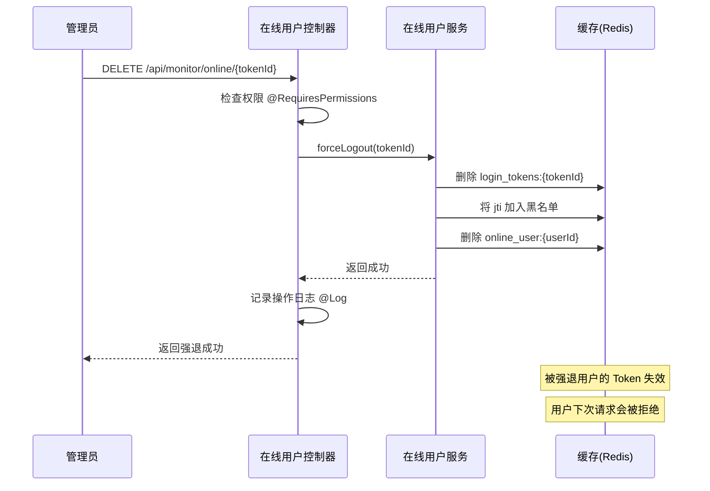

# 在线用户强退功能实现说明

## 功能对比

### Spring Boot 版本

```java
@PreAuthorize("@ss.hasPermi('monitor:online:forceLogout')")
@Log(title = "在线用户", businessType = BusinessType.FORCE)
@DeleteMapping("/{tokenId}")
public AjaxResult forceLogout(@PathVariable String tokenId)
{
    redisCache.deleteObject(CacheConstants.LOGIN_TOKEN_KEY + tokenId);
    return success();
}
```

**核心逻辑**：
- 从 Redis 删除 `login_tokens:{tokenId}` 键
- 返回成功响应

### Egg.js 版本

```javascript
@Log({ title: '在线用户', businessType: BusinessType.FORCE })
@RequiresPermissions('monitor:online:forceLogout')
@HttpDelete('/:tokenId')
async forceLogout() {
  const { ctx, service } = this;
  
  try {
    const { tokenId } = ctx.params;
    
    // 强退用户
    await service.monitor.online.forceLogout(tokenId);
    
    ctx.body = {
      code: 200,
      msg: '强退成功'
    };
  } catch (err) {
    ctx.logger.error('强退用户失败:', err);
    ctx.body = {
      code: 500,
      msg: err.message || '强退用户失败'
    };
  }
}
```

**核心逻辑**（Service 层）：
```javascript
async forceLogout(tokenId) {
  const { app } = this;
  
  // 1. 删除登录 Token 缓存（主要逻辑）
  const loginTokenKey = CacheConstants.LOGIN_TOKEN_KEY + tokenId;
  await app.cache.default.del(loginTokenKey);
  
  // 2. 将 Token 加入黑名单
  const jwtPayload = app.jwt.decode(tokenId);
  if (jwtPayload && jwtPayload.jti) {
    await app.cache.default.set(jwtPayload.jti, 'revoked', { ttl: 7 * 24 * 60 * 60 });
  }
  
  // 3. 删除在线用户信息
  const onlineKeys = await app.cache.default.keys(CacheConstants.LOGIN_TOKEN_KEY + '*');
  
  for (const key of onlineKeys) {
    const onlineUser = await app.cache.default.get(key);
    
    if (onlineUser && onlineUser.tokenId === tokenId) {
      await app.cache.default.del(key);
      break;
    }
  }
  
  return true;
}
```

## 实现要点

### 1. 缓存常量定义

参照 Spring Boot 的 `CacheConstants`，在 `app/constant/index.js` 中添加：

```javascript
module.exports.CacheConstants = {
  // 登录用户 Token 缓存键前缀
  LOGIN_TOKEN_KEY: 'login_tokens:',
  
  // 验证码缓存键前缀
  CAPTCHA_CODE_KEY: 'captcha_codes:',
  
  // 用户权限缓存键前缀
  USER_PERMISSIONS_KEY: 'user:permissions:',
  
  // 用户角色缓存键前缀
  USER_ROLES_KEY: 'user:roles:'
};
```

### 2. 操作日志装饰器

添加 `@Log` 装饰器记录强退操作：

```javascript
const { Log, BusinessType } = require('../../decorator/log');

@Log({ title: '在线用户', businessType: BusinessType.FORCE })
```

其中 `BusinessType.FORCE = 7` 表示强退操作。

### 3. 三层清除逻辑

**为什么需要三层清除？**

1. **删除 login_tokens 缓存**（最重要）
   - Spring Boot 也是删除这个键
   - 这是用户登录状态的主要存储

2. **Token 加入黑名单**
   - 防止已强退的 Token 再次使用
   - 配合 JWT 配置的 `isRevoked` 检查

3. **删除在线用户信息**
   - 清理在线用户列表显示
   - 确保用户不会出现在在线用户列表中

### 4. 与 Spring Boot 的差异

| 项目 | Spring Boot | Egg.js |
|------|-------------|--------|
| **主要逻辑** | 删除 `login_tokens:{tokenId}` | 相同 |
| **额外逻辑** | 无 | 1. Token 黑名单<br>2. 清理在线用户 |
| **原因** | Spring Security 自动处理 | 需要手动清理多个缓存 |

## 使用示例

### 请求格式

```bash
DELETE http://localhost:7001/api/monitor/online/{tokenId}
Authorization: Bearer YOUR_ADMIN_TOKEN
```

### 响应示例

**成功响应**：
```json
{
  "code": 200,
  "msg": "强退成功"
}
```

**失败响应**：
```json
{
  "code": 500,
  "msg": "强退用户失败"
}
```

## 工作流程



## 效果验证

### 1. 强退前

被强退用户可以正常访问接口：

```bash
# 用户 A 的请求
GET http://localhost:7001/api/getInfo
Authorization: Bearer TOKEN_A

# 返回 200 OK
{
  "code": 200,
  "user": {...}
}
```

### 2. 管理员强退

```bash
# 管理员操作
DELETE http://localhost:7001/api/monitor/online/TOKEN_A
Authorization: Bearer ADMIN_TOKEN

# 返回成功
{
  "code": 200,
  "msg": "强退成功"
}
```

### 3. 强退后

被强退用户无法访问接口：

```bash
# 用户 A 再次请求
GET http://localhost:7001/api/getInfo
Authorization: Bearer TOKEN_A

# 返回 401 Unauthorized
{
  "code": 401,
  "msg": "Token 已失效"
}
```

## 权限配置

### 数据库配置

确保数据库中存在强退权限：

```sql
-- 查看强退权限
SELECT menu_id, menu_name, perms 
FROM sys_menu 
WHERE perms = 'monitor:online:forceLogout';

-- 如果不存在，需要插入
INSERT INTO sys_menu (
    menu_id, menu_name, parent_id, order_num, path, component,
    is_frame, is_cache, menu_type, visible, status, perms,
    icon, create_time, update_time
) VALUES (
    1010, '在线用户强退', 109, 2, '#', '',
    1, 0, 'F', '0', '0', 'monitor:online:forceLogout',
    '#', NOW(), NOW()
);

-- 为管理员角色分配权限
INSERT INTO sys_role_menu (role_id, menu_id) 
VALUES (1, 1010);
```

### 装饰器验证

控制器使用 `@RequiresPermissions` 装饰器：

```javascript
@RequiresPermissions('monitor:online:forceLogout')
```

只有拥有此权限的用户才能强退其他用户。

## 相关文件

- **控制器**：`app/controller/monitor/online.js`
- **服务层**：`app/service/monitor/online.js`
- **常量定义**：`app/constant/index.js`
- **日志装饰器**：`app/decorator/log.js`
- **权限装饰器**：`app/decorator/permission.js`

## 注意事项

1. **TokenId 格式**：前端传递的 tokenId 应该是完整的 JWT token，不包含 `Bearer ` 前缀

2. **缓存一致性**：确保 `LOGIN_TOKEN_KEY` 常量与登录时存储的键前缀一致

3. **黑名单过期时间**：设置为 7 天，与 Token 有效期一致

4. **操作日志**：强退操作会自动记录到 `sys_oper_log` 表

5. **权限检查**：需要有 `monitor:online:forceLogout` 权限

## 常见问题

### Q1: 强退后用户仍然能访问？

**A**: 检查以下几点：
1. 确认 `LOGIN_TOKEN_KEY` 常量值正确
2. 确认缓存配置正确（Redis 或文件缓存）
3. 检查 JWT 配置的 `isRevoked` 函数是否生效

### Q2: 如何强退所有在线用户？

**A**: 可以添加一个批量强退接口：

```javascript
@HttpDelete('/clearAll')
async clearAll() {
  const keys = await app.cache.default.keys(CacheConstants.LOGIN_TOKEN_KEY + '*');
  for (const key of keys) {
    await app.cache.default.del(key);
  }
  return { code: 200, msg: '清除成功' };
}
```

### Q3: 强退是否影响其他设备的登录？

**A**: 
- **单 Token 模式**：会强退所有设备
- **多 Token 模式**：只强退指定 Token 对应的设备

当前实现为单 Token 模式，一个用户只有一个 Token。
